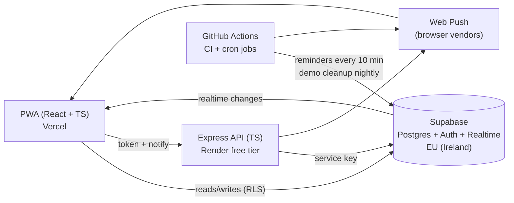

# Hemmaplanen

A household app for shopping, calendar, to-dos and medicine, used every day by my family. Installable as a PWA on iPhone and Android.

**Live:** https://hemmaplanen.vercel.app (press **Prova demo** to try it with a made-up family, no login needed)

<!-- Screenshots: add phone screenshots of each tab here -->

## Features

- **Shopping list** – quick add ("2 mjölk"), grouped by store section, remembers amount, unit and category per household, live sync between phones, push notification when something is added.
- **Calendar** – month view with ISO week numbers, Swedish red days and name days, events colored per person.
- **To-dos** – assigned to a household member or shared, filtered per person.
- **Medicine** – log doses with a minimum interval per medicine (Alvedon/Ipren 4 h), status "wait / can give / should give", reminders at 1×, 1.5× and 2× the interval, inhaler counter with puffs left and low warning.
- **Household** – invite code to join, members can be people without a login (kids), light and dark theme.

## Architecture



| Part | Tech |
| --- | --- |
| Frontend | React 19, TypeScript, Vite, vite-plugin-pwa |
| Database | Supabase Postgres, Row Level Security, triggers, RPC functions |
| Auth | Google login and anonymous demo sign-in via Supabase Auth |
| Backend | Express 5, TypeScript, helmet, CORS, rate limiting, zod |
| Push | `web-push` with VAPID keys |
| CI/CD | GitHub Actions, Vercel and Render auto-deploy from `main` |

The database schema is described in [docs/schema.md](docs/schema.md).

## Trade-offs

**Why Supabase?** Postgres with real relations, foreign keys and SQL, plus login, realtime and a free tier with no credit card. The old version used Firebase, where the rules and data shape were harder to reason about.

**Why do reads and writes skip the backend?** Render's free tier sleeps after inactivity and takes up to a minute to wake. The app talks to Supabase directly, so it is always fast. Security lives in the database: Row Level Security makes sure a user only sees their own household, and triggers validate things like the medicine interval, so no client can bypass them.

**What does the backend do then?** Only what needs a secret: verifying the user's token and sending push notifications. It uses least-privilege grants, so it can only read the tables it needs.

**Why GitHub Actions for reminders?** A scheduled workflow runs every 10 minutes for free and does not depend on the backend being awake. A database function claims due reminders atomically so the same reminder is never sent twice.

**Why a PWA and not an App Store app?** Free, one codebase, and installable from the browser. The catch is that iPhone only allows push notifications when the app is added to the home screen.

## Privacy and GDPR

Medicine logs are health data, a special category under GDPR Article 9. How it is handled:

- Data is stored in the EU (Supabase, eu-west-1).
- Every table is protected by Row Level Security: only members of a household can read or change its data. This is covered by database tests.
- The backend's secret key never reaches the browser or git.
- The service worker only caches the app shell, never household data.
- Demo households use made-up data and are deleted every night.
- Push notifications contain no more than needed (medicine name and person).

## Tests

| Where | Tool | Tests |
| --- | --- | --- |
| Frontend | Vitest + React Testing Library | 18 |
| Backend | Vitest + Supertest | 18 |
| Database | pgTAP (RLS isolation, triggers, demo) | 62 |

All three run in CI on every pull request and are required to merge to `main`.

<!-- Lighthouse scores: add after the accessibility pass (#9) -->

## Run locally

Needs Node 24, Docker and the [Supabase CLI](https://supabase.com/docs/guides/cli).

```bash
# 1. Database
supabase start
supabase db reset          # runs all migrations

# 2. Frontend
cp frontend/.env.example frontend/.env.local   # fill in keys from `supabase status`
npm --prefix frontend install
npm --prefix frontend run dev

# 3. Backend (only needed for push)
cp backend/.env.example backend/.env           # generate VAPID keys: npx web-push generate-vapid-keys
npm --prefix backend install
npm --prefix backend run dev
```

Run the tests:

```bash
npm --prefix frontend test
npm --prefix backend test
supabase test db
```

## Project structure

```
frontend/   React app, one folder per feature in src/features/
backend/    Express API and scheduled jobs (src/jobs/)
supabase/   migrations and pgTAP tests
scripts/    one-off Firebase migration script
docs/       database schema
```
