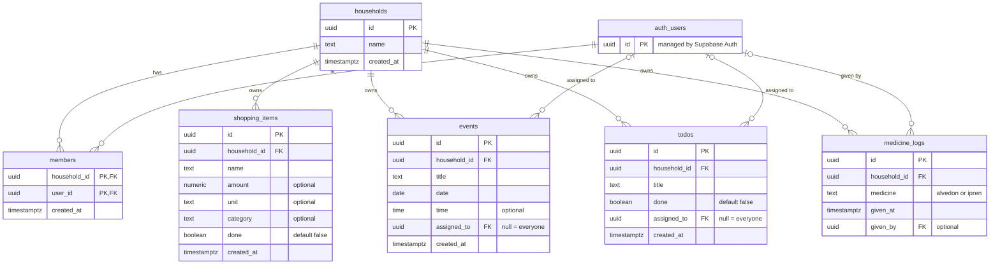

# Database schema

Postgres on Supabase. Every app table belongs to a household, which is what Row Level Security filters on. Users live in Supabase Auth (`auth.users`) and are linked to households through `members`.

## Delete behaviour

| Relation | On delete | Why |
|---|---|---|
| Household → members and all app tables | `cascade` | Deleting a household removes all of its data. |
| User → members | `cascade` | A deleted user leaves every household. |
| User → `assigned_to`, `given_by` | `set null` | The event, to-do or dose stays; it just loses who it belonged to. |

## Design notes

- `members` uses a composite primary key (`household_id`, `user_id`), so a user can only join a household once.
- `assigned_to` replaces the old app's hardcoded names ("Alexander", "Alexandra", "Båda"), so any household, including the demo household, can use it. `null` means everyone.
- `medicine_logs` stores one row per dose instead of only the latest one, which gives a full history. Allowed medicines are enforced with a check constraint.
